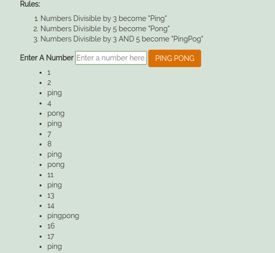

# Ping-Pong
#### A javascript application that takes user input and then outputs ping,pong,and pingpong based on specific parameters., 29 March 2018
#### By **LAWRENCE KARANJA**
## Description
Ping-pong is a javascript application that takes user input and then outputs ping,pong,pingpong,or numbers based on the divisibility of the number by 3,5 or by both 3 and 5 and if a number is not divisible by any of the set parameters that we have, it is output as is.
## Setup/Installation Requirements
* The application uses custom fonts, so you are free to change them if you wish.
* The application also uses JQuery and Bootstrap
* If you need to use your own custom styles you can define them within the css/styles.css file.

When all the Requirements have been met, you can simply clone the application by running the  command `git clone https://github.com/lawrence254/pingpong.git` on your local machine and you can run your own version. You can also access the website from this [link](https://lawrence254.github.io/pingpong/) or the one provided above if you first want to see how the application works.
## Known Bugs/Updates/Corrections
The application currently doesn't have any bugs. If any are spotted you can open an issue by clicking on this [link](https://github.com/lawrence254/pingpong/issues) and selecting `New Issue` on the resulting page and I will look into it.

##Specifications
The following are the specifications for this application:
#### INPUT
* The application only works when a user enters an integer into the text box. Example Input:
  * 1,15,400,1000
#### OUTPUT
* The application has 4 types of output as listed below:
  * `ping` - This output will only be shown if a number is divisible by 3.
  * `pong` - This output is hown when a value is divisible by 5.
  * `pingpong` - This output is a result of a value being divisible by both 3 and 5.
* Example output of the application is shown below.

####INPUT TYPE
* The application has a httml5 input validation for number. This forces it to only accept integers as the input.

## Built Using
* HTML5
* CSS3
* JQuery
* Google Fonts

## Contact details
You can contact me at lawrenslava1[at]gmail[dot]com
### License
[License](https://github.com/lawrence254/pingpong/blob/master/LICENSE)
*MIT*
Copyright (c) 2018 **LAWRENCE KARANJA**
